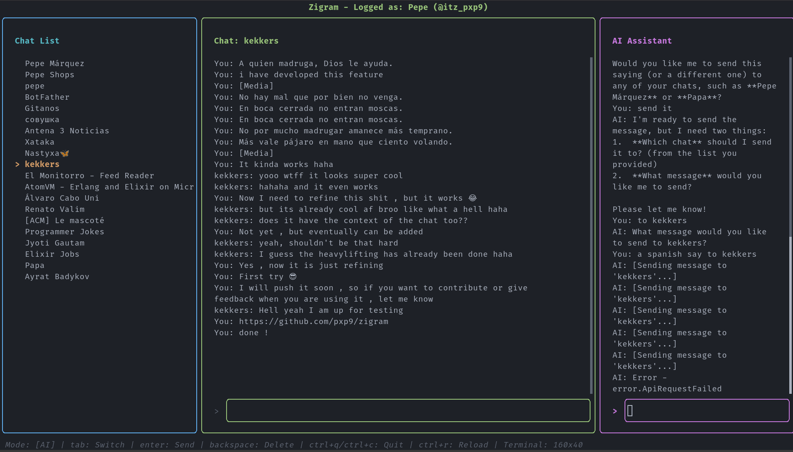

# Zigram

A Terminal User Interface (TUI) Telegram client written in Zig.



## Prerequisites

- Zig 0.15.2 or later
- A Telegram account

**Note**: TDLib (Telegram Database Library) is automatically downloaded during
the build process via `build.zig`.

## Configuration

### Telegram API Credentials

To use Zigram, you need to obtain API credentials from Telegram:

1. Go to <https://my.telegram.org/auth>
2. Log in with your phone number
3. Navigate to "API development tools"
4. Create a new application to get your `api_id` and `api_hash`

Set the credentials as environment variables:

``` bash
export API_ID="your_api_id"
export API_HASH="your_api_hash"
```

**Tip**: Add these to your `~/.bashrc`, `~/.zshrc`, or equivalent shell
configuration file to make them persistent.

**Note**: If these environment variables are not set, Zigram will use default
test credentials (not recommended for production use).

### Keybindings

You can customize keybindings by creating or editing
`~/.config/zigram/zigram.json`:

``` json
{
  "ai": {
    "enabled": true,
    "provider": "google_ai",
    "google_ai": {
      "api_key": "your_key",
      "model": "gemini-2.5-flash-preview",
      "system_prompt": "Your custom system prompt here"
    }
  },
  "datetime_format": "%H:%M",
  "keybindings": {
    "quit": "q",
    "quit_ctrl": "ctrl+c",
    "switch_mode": "tab",
    "navigate_up": "k",
    "navigate_up_alt": "up",
    "navigate_down": "j",
    "navigate_down_alt": "down",
    "select": "enter",
    "backspace": "backspace",
    "reload_config": "ctrl+r"
  }
}
```

#### Default Keybindings

| Action | Default Key | Description |
| --- | --- | --- |
| Quit | `q` or `Ctrl+C` | Exit the application |
| Switch Mode | `Tab` | Cycle between Chat, LLM, and Chat List modes |
| Navigate Up | `k` or `↑` | Move up in chat list |
| Navigate Down | `j` or `↓` | Move down in chat list |
| Select | `Enter` | Select chat or send message |
| Delete Character | `Backspace` | Delete character in input field |
| Reload Config | `Ctrl+R` | Reload keybindings from config file |
| Scroll Messages | `Page Up/Down` | Scroll through chat messages (when input is empty) |
| Jump to Top/Bottom | `Home/End` | Jump to first/last message (when input is empty) |

After modifying keybindings, press `Ctrl+R` within the application to reload the
configuration without restarting.

### DateTime Format

You can customize how message timestamps are displayed using the `datetime_format` option in your config file. This uses C's strftime format syntax.

**Default format**: `"%H:%M"` (displays as `HH:MM`, e.g., `14:35`)

**Common format specifiers**:

- `%H` - Hour (00-23)
- `%M` - Minute (00-59)
- `%S` - Second (00-59)
- `%Y` - Year (4 digits, e.g., 2026)
- `%m` - Month (01-12)
- `%d` - Day of month (01-31)
- `%I` - Hour (01-12)
- `%p` - AM/PM
- `%A` - Full weekday name (e.g., Monday)
- `%B` - Full month name (e.g., January)

**Example formats**:

- `"%H:%M"` → `14:35`
- `"%H:%M:%S"` → `14:35:42`
- `"%Y-%m-%d %H:%M"` → `2026-01-21 14:35`
- `"%d/%m/%Y %H:%M"` → `21/01/2026 14:35`
- `"%I:%M %p"` → `02:35 PM`
- `"%A, %B %d"` → `Tuesday, January 21`

If the format string is invalid, Zigram will log an error and fall back to the default format. Press `Ctrl+R` to reload after changing the format.

### AI Configuration

#### Enabling/Disabling AI

You can completely disable the AI assistant panel by setting `enabled` to `false` in your config file:

``` json
{
  "ai": {
    "enabled": false
  }
}
```

When AI is disabled:
- The interface switches to a 2-panel layout (chat list + main chat)
- The AI panel is hidden
- Tab key cycles only between Chat and Chat List modes
- No AI thread is spawned, reducing resource usage

**Default**: AI is enabled if not specified.

#### AI System Prompt

You can customize the AI assistant's behavior by setting a `system_prompt` in your config file.

**Default system prompt**:
```
You are a helpful assistant integrated into a Telegram client. Answer in the same language the user is using or in the language the user requests. Be concise and helpful.
```

To override it, add `system_prompt` to the `google_ai` section in your config file (see example above).

## Usage Modes

Zigram has three input modes (or two if AI is disabled):

1. **Chat Mode**: Type and send messages in the selected chat
2. **LLM Mode**: Interact with the AI assistant (right panel) - *only available when AI is enabled*
3. **Chat List Mode**: Navigate and select chats

Press `Tab` to cycle between modes.

## Panels

The interface is divided into three panels (or two if AI is disabled):

- **Left Panel**: Chat list - shows your recent conversations
- **Center Panel**: Main chat window - displays messages from the selected chat
- **Right Panel**: AI Assistant - chat with an AI *(only shown when AI is enabled)*

## Log File

Zigram writes logs to `~/.local/share/zigram/zigram.log`.

## Building

``` bash
zig build
```

The build script will automatically download TDLib if not already present.

## Running

``` bash
# Make sure to set your API credentials first
export API_ID="your_api_id"
export API_HASH="your_api_hash"

zig build run
```

Or after building:

``` bash
./zig-out/bin/zigram
```

by default it will use known developing credentials

## First Run

On first run, Zigram will:

1. Prompt you to enter your phone number (with country code, e.g., +1234567890)
2. Send you a verification code via Telegram
3. Ask you to enter the code
4. If you have 2FA enabled, ask for your password

Your session will be saved, so you won't need to authenticate again unless you
log out.

Logging out is remove the tdlib folder, currently there is no a way to logout.

## Directory Structure

    ~/.config/zigram/
    └── zigram.json      # Keybindings configuration
    
    ~/.local/share/zigram/
    └── zigram.log       # Application logs
    
    <project_root>/.data/tdlib/
    └── ...              # Telegram session data (managed by TDLib)

## Troubleshooting

### Authentication Issues

If you encounter authentication problems:

1. Verify your `API_ID` and `API_HASH` environment variables are set correctly
2. Check the log file at `~/.local/share/zigram/zigram.log` for error messages
3. Delete the TDLib data directory (`.data/tdlib/` in the project root) to start
   fresh

### Configuration Not Loading

- Ensure `~/.config/zigram/zigram.json` is valid JSON (use a JSON validator)
- Check file permissions on config files
- Press `Ctrl+R` to reload keybindings after editing
- Check logs for configuration errors

### Application Crashes

- Check `~/.local/share/zigram/zigram.log` for error messages
- Ensure you're using a compatible Zig version (0.15.2+)
- If TDLib download fails, check your internet connection and try rebuilding
